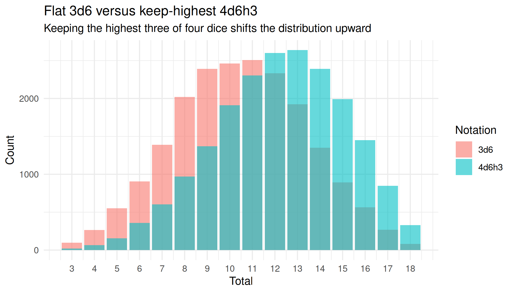
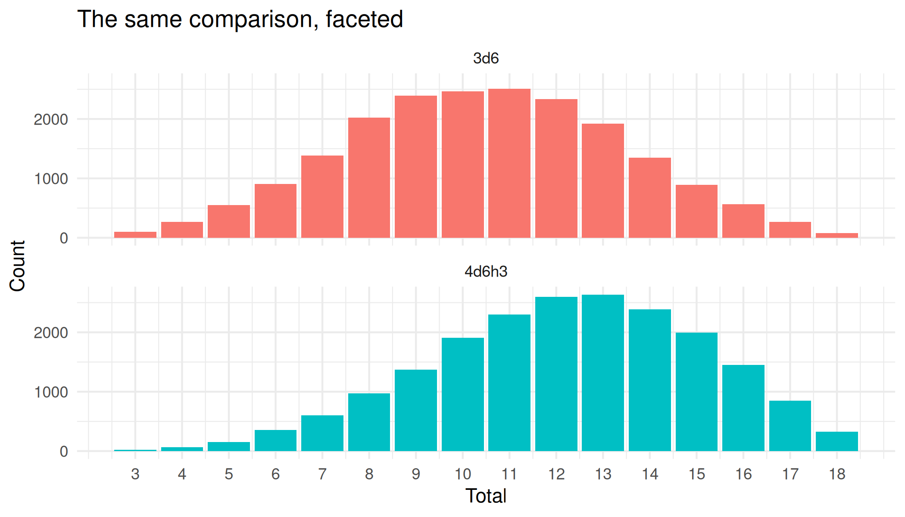

# Visualising roll distributions

``` r

library(rollr2)
library(ggplot2)
```

[`roll_distribution()`](https://felixmil.github.io/rollr2/reference/roll_distribution.md)
samples many rolls and tallies how often each total comes up. The
console print method draws a text histogram, but the same `counts` are
easy to plot with ggplot2 for a clearer picture of a notation’s shape.
Because the distribution is sampled, every chunk below fixes a seed so
the figures are reproducible.

## From counts to a data frame

The `counts` field is a named integer vector: the names are the outcome
totals and the values are how often each total occurred. Turn it into a
tidy data frame by reading the names as the total and stripping the
names off the values.

``` r

set.seed(1)
d <- roll_distribution("2d6", n = 10000)

dist_df <- data.frame(
  total = as.integer(names(d$counts)),
  count = as.integer(d$counts)
)
head(dist_df)
#>   total count
#> 1     2   283
#> 2     3   577
#> 3     4   823
#> 4     5  1115
#> 5     6  1409
#> 6     7  1614
```

## A single distribution

Two six-sided dice give the familiar triangular distribution, peaking at
7.

``` r

ggplot(dist_df, aes(x = total, y = count)) +
  geom_col(fill = "steelblue") +
  scale_x_continuous(breaks = dist_df$total) +
  labs(
    title = "Distribution of totals for 2d6",
    subtitle = paste0(format(d$n, big.mark = ","), " simulated rolls"),
    x = "Total",
    y = "Count"
  ) +
  theme_minimal()
```


## Comparing a flat roll with a keep selector

Keep selectors change a distribution’s shape. A common example is
character-ability generation: `4d6h3` (roll four dice, keep the highest
three) skews higher than a flat `3d6`, even though both range from 3 to
18. A small helper turns any notation into a tidy data frame so several
distributions can be plotted together.

``` r

as_dist_df <- function(notation, n) {
  d <- roll_distribution(notation, n = n)
  data.frame(
    notation = notation,
    total = as.integer(names(d$counts)),
    count = as.integer(d$counts)
  )
}
```

``` r

set.seed(42)
comparison <- rbind(
  as_dist_df("3d6", n = 20000),
  as_dist_df("4d6h3", n = 20000)
)

ggplot(comparison, aes(x = total, y = count, fill = notation)) +
  geom_col(position = "identity", alpha = 0.6) +
  scale_x_continuous(breaks = sort(unique(comparison$total))) +
  labs(
    title = "Flat 3d6 versus keep-highest 4d6h3",
    subtitle = "Keeping the highest three of four dice shifts the distribution upward",
    x = "Total",
    y = "Count",
    fill = "Notation"
  ) +
  theme_minimal()
```



Faceting the same data makes each shape easier to read on its own.

``` r

ggplot(comparison, aes(x = total, y = count, fill = notation)) +
  geom_col(show.legend = FALSE) +
  facet_wrap(vars(notation), ncol = 1) +
  scale_x_continuous(breaks = sort(unique(comparison$total))) +
  labs(
    title = "The same comparison, faceted",
    x = "Total",
    y = "Count"
  ) +
  theme_minimal()
```


