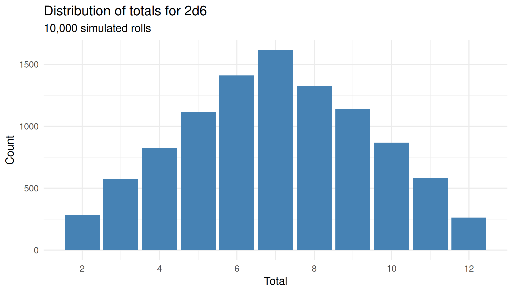
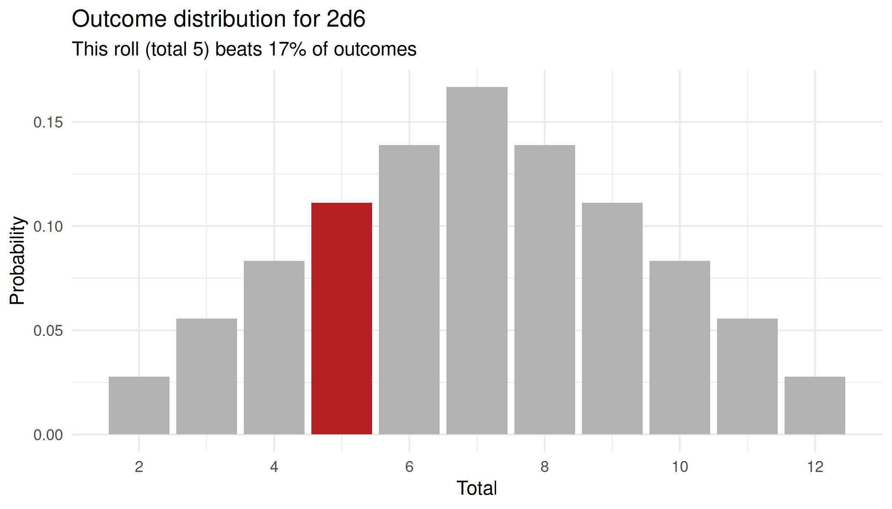
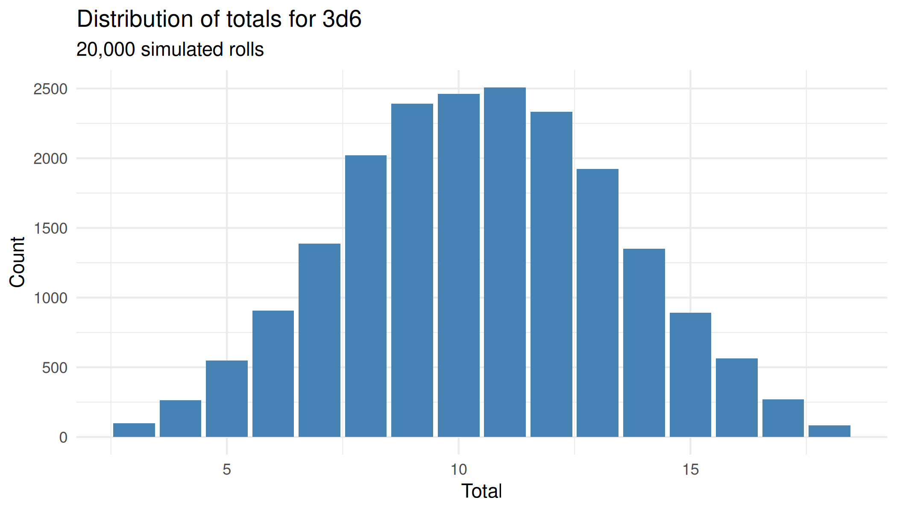
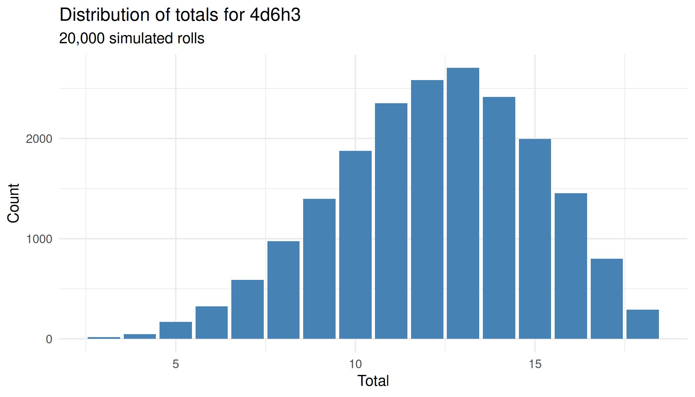
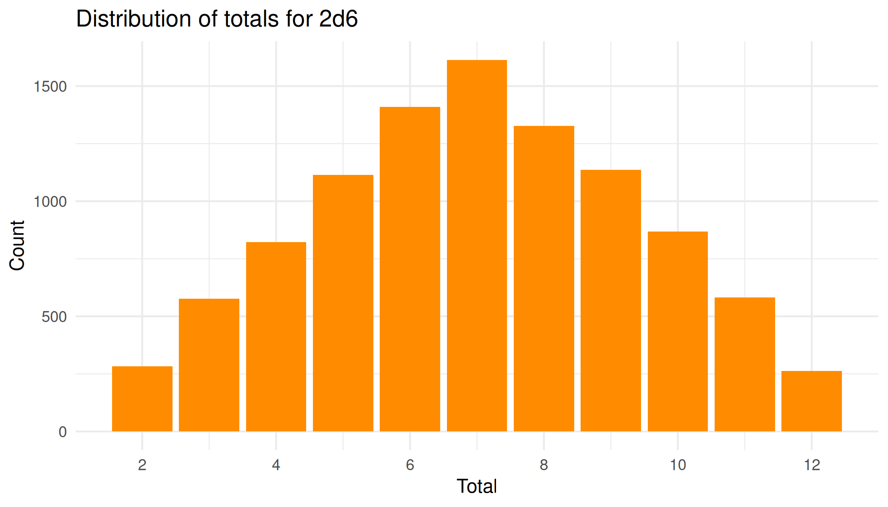

# Visualising roll distributions

``` r

library(rollr2)
library(ggplot2)
```

`rollr2` results carry rich distributional information, and both result
classes have a [`plot()`](https://rdrr.io/r/graphics/plot.default.html)
method that turns a result into a finished, themed ggplot2 chart with a
single call.
[`roll_distribution()`](https://felixmil.github.io/rollr2/reference/roll_distribution.md)
plots the sampled totals from many rolls, while
[`roll()`](https://felixmil.github.io/rollr2/reference/roll.md) plots
the notation’s exact theoretical outcome distribution with the rolled
total highlighted. Because
[`roll_distribution()`](https://felixmil.github.io/rollr2/reference/roll_distribution.md)
is sampled, the chunks below fix a seed so those figures are
reproducible; `plot(roll(...))` reads the exact distribution and needs a
seed only to fix which total gets highlighted.

## A sampled distribution

[`roll_distribution()`](https://felixmil.github.io/rollr2/reference/roll_distribution.md)
samples many rolls and tallies how often each total comes up. Passing
the result to [`plot()`](https://rdrr.io/r/graphics/plot.default.html)
draws a bar chart of those counts across the notation’s total range. Two
six-sided dice give the familiar triangular distribution, peaking at 7.

``` r

set.seed(1)
d <- roll_distribution("2d6", n = 10000)
plot(d)
```



## A single roll against its distribution

[`plot()`](https://rdrr.io/r/graphics/plot.default.html) on a `roll`
shows the notation’s exact theoretical outcome distribution and
highlights the bar for the total you actually rolled. The subtitle
reports the roll’s percentile standing, the same “beats P% of outcomes”
reading the `compare = TRUE` print path uses. The plot always shows the
theoretical distribution, whether or not the roll was created with
`compare = TRUE`.

``` r

set.seed(7)
plot(roll("2d6"))
```



## Comparing a flat roll with a keep selector

Keep selectors change a distribution’s shape. A common example is
character-ability generation: `4d6h3` (roll four dice, keep the highest
three) skews higher than a flat `3d6`, even though both range from 3 to
18. Sampling each notation and plotting the results shows the shift.

``` r

set.seed(42)
plot(roll_distribution("3d6", n = 20000))
```



``` r

set.seed(42)
plot(roll_distribution("4d6h3", n = 20000))
```



## Extending a returned plot

Each [`plot()`](https://rdrr.io/r/graphics/plot.default.html) method
returns a standard `ggplot` object, so you can capture it and keep
composing with `+`, for example to recolour the bars or drop the
subtitle.

``` r

set.seed(1)
p <- plot(roll_distribution("2d6", n = 10000))
p +
  geom_col(fill = "darkorange") +
  labs(subtitle = NULL)
```


